<h1 align="center">NewsPortal — Portal Berita Multi-Role</h1>

<p align="center">
  <em>Aplikasi portal berita profesional berbasis Laravel 13 dengan tiga peran pengguna,
  panel redaksi, editor teks kaya (CKEditor 5), dan tampilan editorial modern.</em>
</p>

<p align="center">
  <a href="https://1124100299.up.railway.app"><strong>🌐 Demo Langsung → https://1124100299.up.railway.app</strong></a>
</p>

---

## 👤 Identitas Mahasiswa

| | |
|---|---|
| **Nama** | Andika Dwi Saputra |
| **NIM** | 1124100299 |
| **Kode Kelas** | 74085 |
| **Mata Kuliah** | Pemrograman Web 2 |
| **Dosen Pengampu** | Dendy Kurniawan, M.Kom |
| **Universitas** | Universitas STEKOM |
| **Repositori** | https://github.com/andikadevs/portal |
| **Demo Online** | https://1124100299.up.railway.app |

> Proyek ini adalah **Tugas Projek Portal Berita** (Pertemuan 9–14) dan dikerjakan
> dengan memanfaatkan **GitHub** serta bantuan **AI** dalam pengembangan aplikasi PHP,
> sesuai materi Pertemuan 15. Aplikasi dionlinekan penuh (Pilihan 3 pengumpulan) —
> seluruh fitur berjalan pada tautan publik di atas.

---

## 🔑 Akun Demo

Silakan masuk melalui halaman **[/login](https://1124100299.up.railway.app/login)**.

| Peran | Email | Kata Sandi | Hak Akses |
|-------|-------|------------|-----------|
| **Ketua** (Pemimpin Redaksi / super-admin) | `ketua@newsportal.test` | `password` | Dashboard, Kelola Artikel, Kelola Kategori, **Kelola User**, **Statistik** |
| **Admin** (Editor) | `admin@newsportal.test` | `password` | Dashboard, Kelola Artikel, Kelola Kategori |
| **Pengunjung** | *(tanpa login)* | — | Membaca, menelusuri kategori, mencari, dan berkomentar |

---

## ✨ Fitur

### Untuk Pengunjung (publik)
- **Beranda dinamis** — berita utama (*hero*), rail "Terbaru", dan seksi per-kategori.
- **Detail artikel** — isi lengkap, penulis, tanggal, dan **3 artikel terkait** sekategori.
- **Halaman kategori** — seluruh artikel satu rubrik dengan **pagination** (9/halaman).
- **Pencarian** — pencarian global (`/cari`) dan pencarian di dalam kategori.
- **Komentar publik** — pengunjung mengirim komentar (nama, email, isi) dengan validasi.
- **Halaman Tentang** — profil redaksi.

### Autentikasi
- **Login multi-role kustom** (tanpa Breeze) dengan **rate limiting** (maks. 5 percobaan per email+IP).
- Tidak ada registrasi publik — akun dibuat oleh Ketua.

### Panel Redaksi (Admin & Ketua)
- **Dashboard sesuai peran** — Ketua melihat statistik global; Admin melihat ringkasan kontennya.
- **CRUD Artikel** — buat/ubah/hapus, **CKEditor 5** (teks kaya), *slug* unik otomatis,
  sanitasi HTML anti-XSS (`mews/purifier`), dan thumbnail via **unggah berkas** atau **pemilih Pexels**.
- **CRUD Kategori** — dengan kode warna rubrik; kategori yang masih punya artikel tidak bisa dihapus.

### Khusus Ketua
- **Kelola User (CRUD)** — tambah/ubah/hapus pengguna, atur peran, kata sandi ter-*hash*
  (tidak bisa menghapus akun sendiri).
- **Halaman Statistik** — total user/kategori/artikel/komentar, distribusi artikel per kategori,
  dan peringkat artikel per penulis.

### Pemilih Thumbnail Pexels
- Cari & pilih foto langsung dari **Pexels** di form artikel (nonaktif otomatis bila API key kosong).

---

## 🖼️ Tangkapan Layar

### Tampilan Publik

| Beranda | Detail Artikel |
|---|---|
| 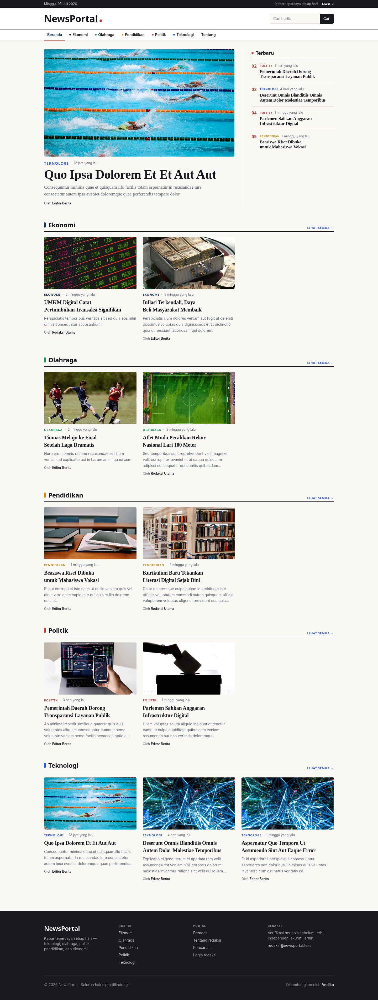 | 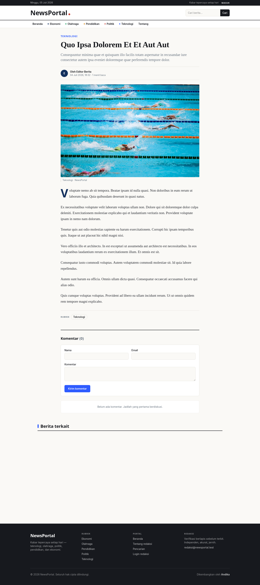 |

| Halaman Kategori + Pagination | Pencarian |
|---|---|
| 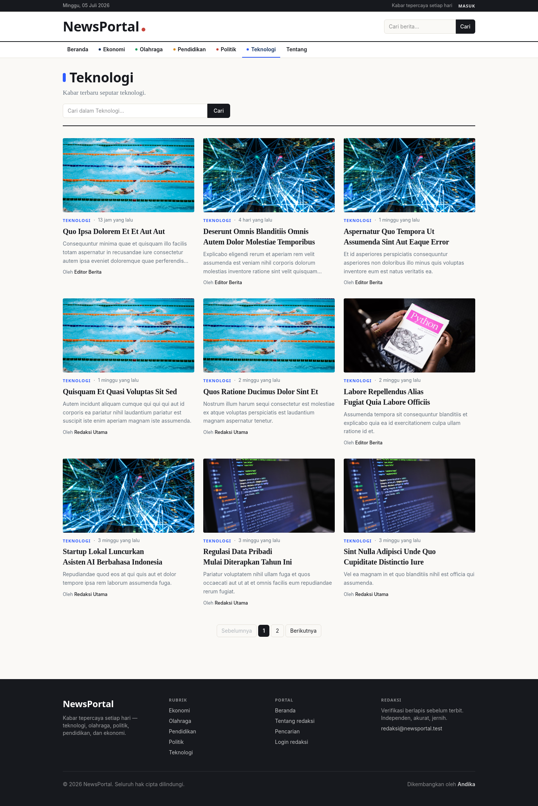 | 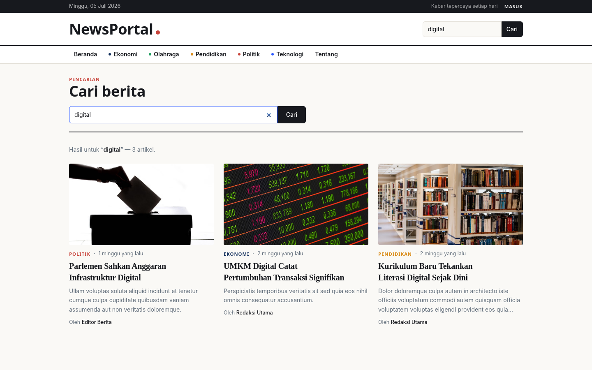 |

| Tentang | Login |
|---|---|
| 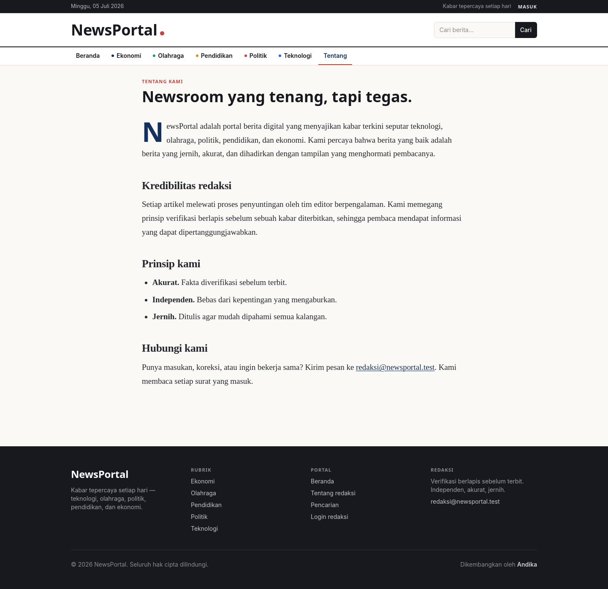 | 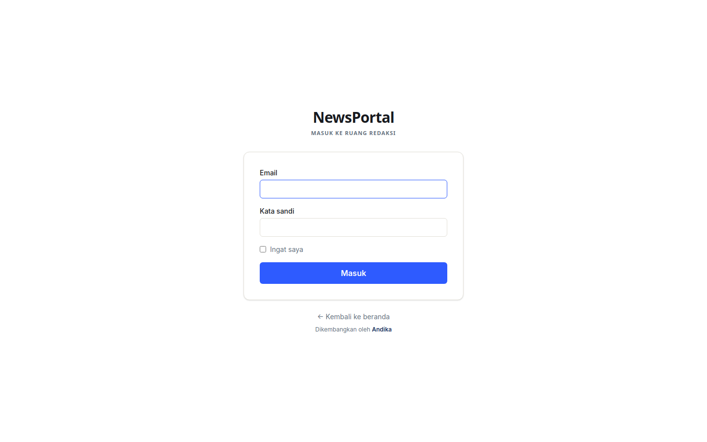 |

### Panel Redaksi

| Dashboard Ketua | Statistik (khusus Ketua) |
|---|---|
| 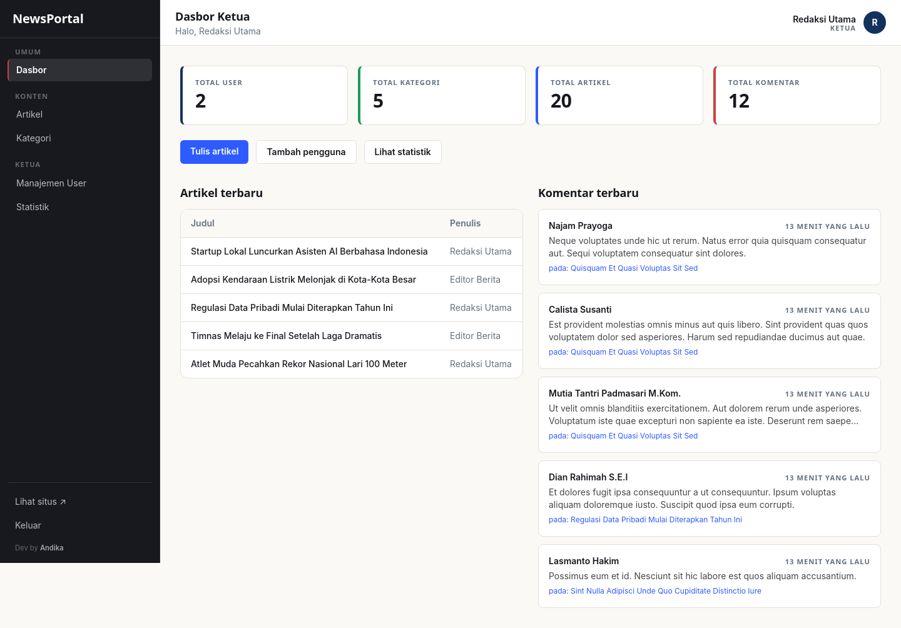 | 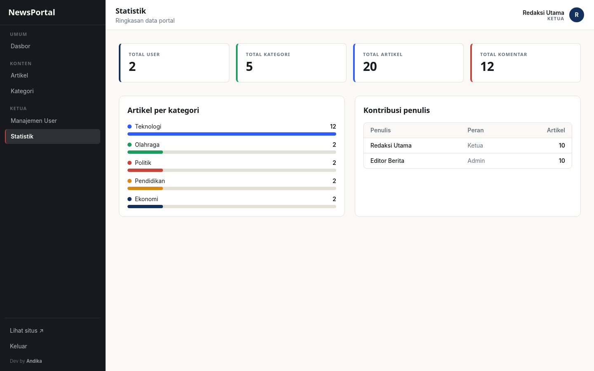 |

| Kelola Artikel | Form Artikel (CKEditor 5) |
|---|---|
| 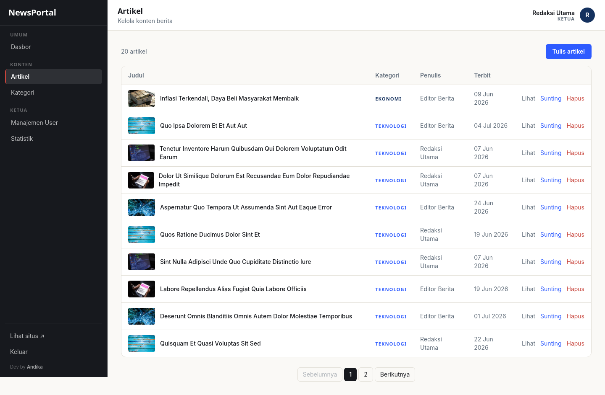 | 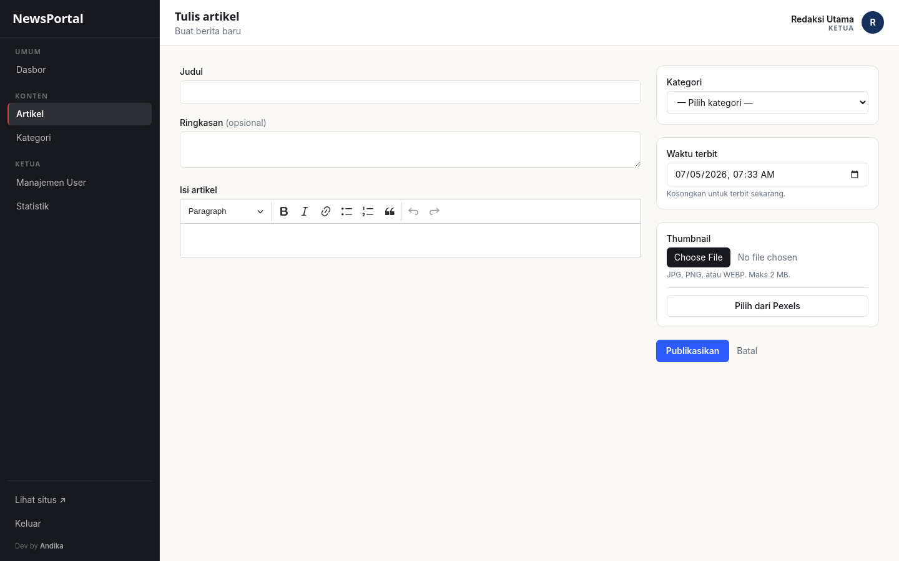 |

| Kelola Kategori | Kelola User (khusus Ketua) |
|---|---|
| 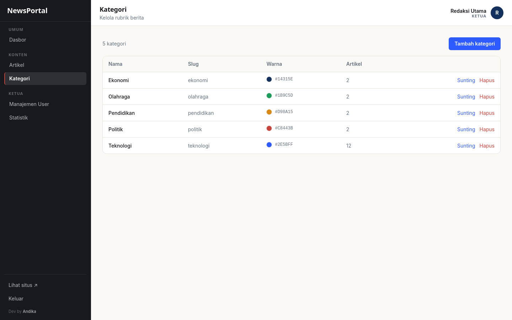 | 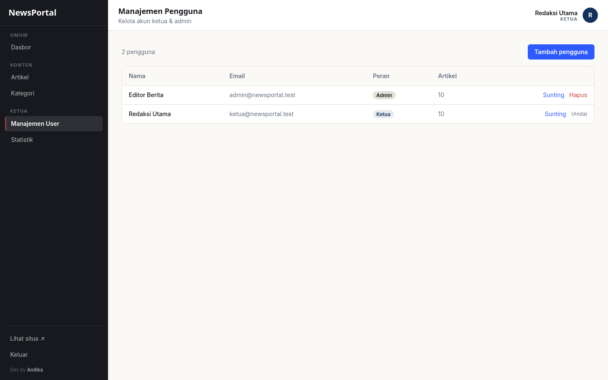 |

| Dashboard Admin (menu terbatas) |
|---|
| 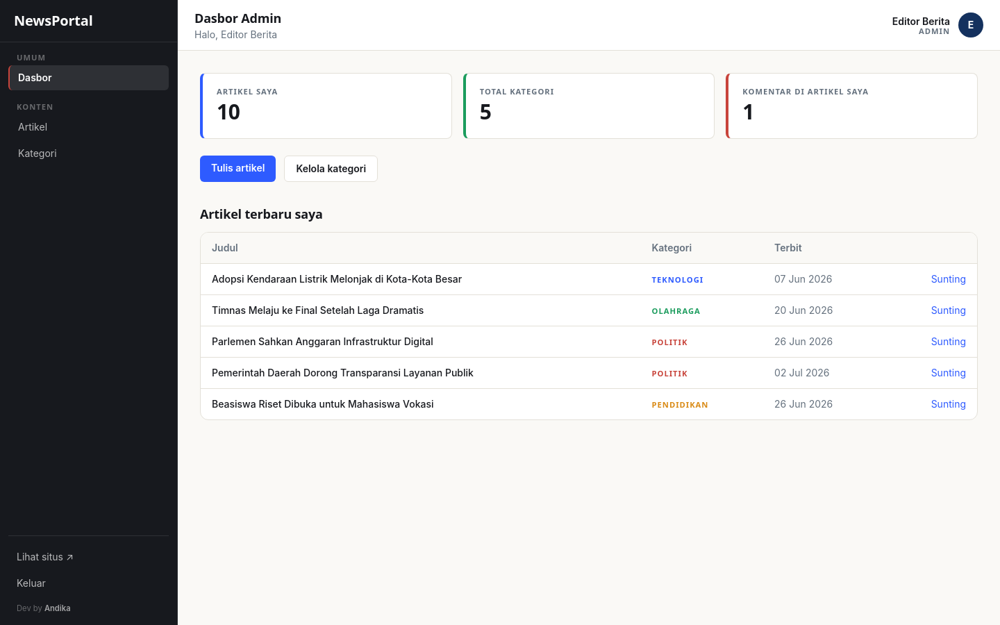 |

---

## 🧰 Teknologi

- **Laravel 13** · PHP 8.4+ (dikembangkan pada PHP 8.5)
- **MySQL 8** (session, cache, & queue memakai driver `database`)
- **Blade** + **Tailwind CSS v4** (Vite 8)
- **CKEditor 5** (rich text editor) · **`mews/purifier`** (sanitasi HTML)
- Autentikasi kustom berbasis facade `Auth` + middleware peran `EnsureUserHasRole`
- **Pexels API** (opsional) untuk pemilih thumbnail
- Lokal `id`, zona waktu `Asia/Jakarta`

---

## 🚀 Menjalankan Secara Lokal

Prasyarat: **PHP 8.4+**, Composer, Node.js 20+, MySQL 8.

```bash
# 1. Dependensi
composer install
npm install

# 2. Environment
cp .env.example .env
php artisan key:generate
# Sunting .env: set DB_DATABASE, DB_USERNAME, DB_PASSWORD

# 3. Buat database lalu migrasi + seed data demo
#    (di MySQL: CREATE DATABASE portal_berita;)
php artisan migrate --seed
php artisan storage:link

# 4. Jalankan (dua terminal)
npm run dev
php artisan serve
```

Buka `http://localhost:8000`. Akun demo tersedia di tabel [Akun Demo](#-akun-demo).

---

## ☁️ Deployment (Railway)

Aplikasi ini dionlinekan di **Railway** menggunakan builder **Railpack** (php-fpm + Caddy)
dan database **MySQL** terkelola.

- Konfigurasi build/deploy: [`railway.json`](railway.json).
- **Pre-deploy** otomatis menjalankan: `migrate --force` → `db:seed --force` (idempoten) →
  `storage:link` → *cache* config/route/view.
- *Health check* pada endpoint `/up`, HTTPS dipaksa di produksi, proxy dipercaya.
- Variabel `DB_*` merujuk service MySQL (`${{MySQL.*}}`); `APP_KEY`, `APP_URL`,
  dan `PEXELS_API_KEY` diset sebagai variabel service.

Panduan langkah demi langkah ada di [`DEPLOY.md`](DEPLOY.md), template variabel di
[`.env.production.example`](.env.production.example).

---

## 🧪 Pengujian

```bash
php artisan test
```

Uji fitur mencakup autentikasi, otorisasi per-peran (Admin vs Ketua), CRUD artikel
(termasuk unggah thumbnail & sanitasi XSS), komentar, pagination, dan endpoint Pexels.

---

## 📁 Struktur Penting

```
app/Http/Controllers/          Controller publik + Admin/*
app/Http/Middleware/           EnsureUserHasRole.php (middleware `role:`)
app/Models/                    User, Category, Article, Comment
app/Services/PexelsService.php Integrasi Pexels
resources/views/               Blade: layout publik & dasbor, komponen
database/seeders/              DatabaseSeeder.php (data demo idempoten)
routes/web.php                 Definisi seluruh rute
railway.json / DEPLOY.md       Konfigurasi & panduan deploy
```

---

<p align="center"><sub>Dikembangkan oleh <strong>Andika Dwi Saputra</strong> · NIM 1124100299 · Kelas 74085 · Universitas STEKOM</sub></p>
